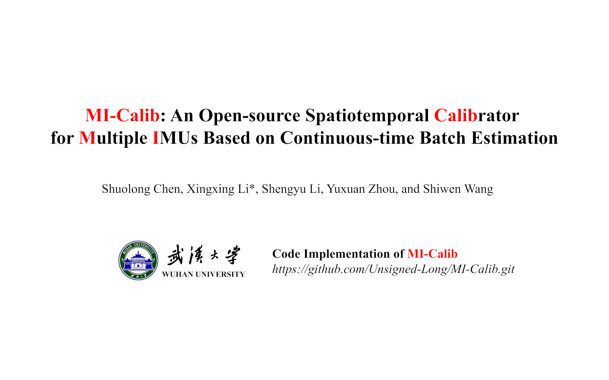

# MI-Calib: Multiple IMUs Spatiotemporal Calibrator

           

<div align=center></div>

## 0. Preliminaries

If you use ***MI-Calib*** in a scientific publication, please cite the following paper 👇:

+ under review

<p align="left">
    <a><strong>Todo List »</strong></a>
</p> 

- [ ] support more inertial ros messages.

## 1. Overview

The inertial measurement unit (IMU), as an interoceptive sensor typically providing high-frequency angular velocity and specific force measurements, has been widely exploited for accurate motion estimation in modern robotic applications, such as autonomous navigation and exploration. Recently, there has been a trend of integrating multiple IMUs in inertial systems, which outperforms traditional standalone ones regarding the resiliency of sensor failures and measurement depletion and is commercially affordable due to the significantly reduced price for IMUs. For such multi-IMU systems, accurate and consistent spatiotemporal calibration is inevitably required to perform information fusion in a unified framework. Considering most existing methods generally involve additional aiding sensors in calibration, lacking convenience and usability, we propose `MI-Calib`: a high-performance multi-IMU spatiotemporal calibrator based on continuous-time batch optimization, which utilizes only raw inertial measurements from multiple IMUs and requires no  prior.

Our accompanying videos are now available on [YouTube](https://youtu.be/JFTkFXbInwk) (click below images to open) and [Bilibili](https://www.bilibili.com/video/BV1hK4y1i7uM/).

  <div align=center>
   <a href="https://youtu.be/JFTkFXbInwk">
      
  </a>
  </div>


## 2. Build MI-Calib

### 2.1 Preparation

+ install `ROS1` (Ubuntu **20.04** is suggested, Ubuntu **18.04** (ros melodic) is also available):

  ```bash
  sudo apt install ros-noetic-desktop-full
  echo "source /opt/ros/noetic/setup.bash" >> ~/.bashrc
  source ~/.bashrc
  ```

  **Requirements: ROS1 & C++17 Support**

+ install `Ceres`:

  see the `GitHub` Profile of **[Ceres](https://github.com/ceres-solver/ceres-solver.git)** library, clone it, compile it, and install it. **Make sure that the version of `Ceres` contains the `Manifold` module. (`Ceres` version equal to 2.2.0 or higher than that)**

+ install `Sophus`:

  see the `GitHub` Profile of **[Sophus](https://github.com/strasdat/Sophus.git)** library, clone it, compile it, and install it. **Set option `SOPHUS_USE_BASIC_LOGGING` on when compile (cmake) the Sophus library, this would avoid to involve `fmt` logger dependency (as the following `spdlog` would use internal `fmt` too, which may lead to conflict).**

+ install `magic-enum`:

  see the `GitHub` Profile of **[magic-enum](https://github.com/Neargye/magic_enum.git)** library, clone it, compile it, and install it.

+ install `Pangolin`:

  see the `GitHub` Profile of **[Pangolin](https://github.com/stevenlovegrove/Pangolin.git)** library, clone it, compile it, and install it.

+ install `cereal`, `yaml-cpp`, and `spdlog`:

  ```bash
  sudo apt-get install libcereal-dev
  sudo apt-get install libyaml-cpp-dev
  sudo apt-get install libspdlog-dev
  ```


### 2.2 Clone and Compile MI-Calib

+ create a ros workspace if needed and clone `MI-Calib` to `src` directory as `mi_calib`:

  ```bash
  mkdir -p ~/MI-Calib/src
  cd ~/MI-Calib/src
  
  git clone --recursive https://github.com/Unsigned-Long/MI-Calib.git mi_calib
  ```
  
  change directory to '`mi_calib`', and run '`build_thirdparty.sh`'.
  
  ```bash
  cd mi_calib
  chmod +x build_thirdparty.sh
  ./build_thirdparty.sh
  ```
  
  this would build '`tiny-viewer`' and '`ctraj`' libraries.
  
+ Prepare for thirdparty ros packages:

  clone ros packages '`sbg_ros_driver`' to '`mi_calib/..`' (directory at the same level as `mi_calib`):
  
  ```sh
  cd ..
  git clone https://github.com/SBG-Systems/sbg_ros_driver.git
  ```
  
  then change directory to the ros workspace to build this package:
  
  ```sh
  cd ..
  catkin_make -DCATKIN_WHITELIST_PACKAGES="sbg_driver"
  ```
  
+ compile `MI-Calib`:

  ```bash
  catkin_make -DCATKIN_WHITELIST_PACKAGES=""
  ```
  


## 3. Launch MI-Calib

### 3.1 Simulation Test

[datasets, launch, result visualization](simu-expr.md)


### 3.2 Real-world Experiments

[datasets, launch, result visualization](real-world-expr.md)

### 3.3 Skip Tutorial

Find a **configure file** named `config-real.yaml` in `/mi_calib/output` **or** from the open-source datasets below:

```txt
# Google Drive
https://drive.google.com/drive/folders/11GTlHyzjSkt6ZXAZs9t6Tmg11Nah2Bx_?usp=sharing
```

Then **change the fields** in the configure files to be compatible with your dataset (there are detailed comments for each field). You only need to change a few fields related to io (input and output), perhaps some additional fields related to optimization.

Then **give the path of your configuration file to the launch file** of `MI-Calib` named `mi-calib-prog.launch` in folder `mi_calib/launch`, Then, we **launch** '`MI-Calib`':

```sh
roslaunch mi_calib mi-calib-prog.launch
```

The corresponding results would be output to the directory you set in the configure file.

**Attention**: 

+ Sufficiently excited motion is required for accurate spatiotemporal calibration in `MI-Calib`!
+ Considering that the weak observability of the intrinsic parameters (i.e., non-orthogonal factors, rotational misalign-
  ments, and biases) in the proposed spatiotemporal calibration, they are required pre-calibrated, which can be accomplished in a separate process. (how to calibrate intrinsics of your IMUs, see [***Real-world Experiments***](real-world-expr.md))
