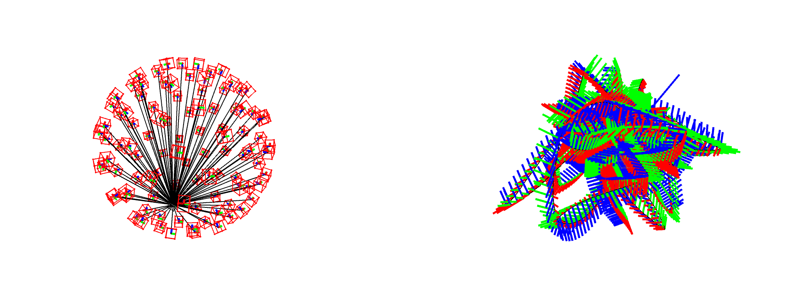

# MI-Calib: Multiple IMUs Spatiotemporal Calibrator

           

## 0. Preliminaries

[](https://git.io/typing-svg)

```cpp
+---------------+-------------------------------------------------+----------------------+
| Author(s)     | GitHub-Profile                                  | E-Mail               |
+---------------+-------------------------------------------------+----------------------+
| Shoulong Chen | https://github.com/Unsigned-Long                | shlchen@whu.edu.cn   |
+---------------+-------------------------------------------------+----------------------+
```

If you use ***MI-Calib*** in a scientific publication, please cite the following  paper:smile::

```latex
# todo...
```

## 1. Overview

Todo ...

https://github.com/Unsigned-Long/MI-Calib/assets/76953144/1bfab4f1-dc1e-4299-9893-cc1d972c8a64

## 2. Build MI-Calib

### 2.1 Preparation

+ install `ROS` (for Ubuntu 20.04):

  ```bash
  sudo apt install ros-noetic-desktop-full
  echo "source /opt/ros/noetic/setup.bash" >> ~/.bashrc
  source ~/.bashrc
  ```

+ install `Ceres`:

  see the `GitHub` Profile of **[Ceres](https://github.com/ceres-solver/ceres-solver.git)** library, clone it, compile it, and install it. Make sure that newest version of `Ceres` is obtained, so that the `Manifold` module is involved.
  
+ install `Sophus`:

  see the `GitHub` Profile of **[Sophus](https://github.com/strasdat/Sophus.git)** library, clone it, compile it, and install it.

+ install `magic-enum`:

  see the `GitHub` Profile of **[magic-enum](https://github.com/Neargye/magic_enum.git)** library, clone it, compile it, and install it.

+ install `fmt`:

  ```bash
  sudo apt-get install libfmt-dev
  ```

+ install `Cereal`:

  ```bash
  sudo apt-get install libcereal-dev
  ```

+ install `spdlog`:

  ```bash
  sudo apt-get install libspdlog-dev
  ```


+ install `Pangolin`:

  see the `GitHub` Profile of **[Pangolin](https://github.com/stevenlovegrove/Pangolin.git)** library, clone it, compile it, and install it.

+ install `yaml-cpp`:

  ```bash
  sudo apt-get install libyaml-cpp-dev
  ```

  

### 2.2 Clone and Compile MI-Calib

+ clone `MI-Calib`:

  ```bash
  git clone --recursive https://github.com/Unsigned-Long/MI-Calib.git 
  ```

  change directory to '`{*}/MI-Calib`', and run '`build_thirdparty.sh`'.
  
  ```bash
  cd {*}/MI-Calib
  chmod +x build_thirdparty.sh
  ./build_thirdparty.sh
  ```
  
  this would build '`tiny-viewer`' and '`ctraj`' libraries.
  
+ prepare for thirdparty ros packages:

  clone ros package '`sbg_ros_driver`' to '`{*}/MI-Calib/src`':

  ```sh
  cd {*}/MI-Calib/src
  git clone https://github.com/SBG-Systems/sbg_ros_driver.git
  ```
  
  then build the package:
  
  ```sh
  cd ..
  catkin_make -DCATKIN_WHITELIST_PACKAGES="sbg_driver"
  ```
  
+ change directory to the ros workspace (i.e., '`{*}/MI-Calib`'), and run:

  ```bash
  cd {*}/MI-Calib
  catkin_make -DCATKIN_WHITELIST_PACKAGES=""
  ```

  

## 3. Launch MI-Calib

### 3.1 Simulation Test

We have already deployed a a program for generating simulation data. Just go to `{*}/MI-Calib/src/mi_calib/launch` folder . Then we launch:

```sh
roslaunch mi_calib mi-calib-simu.launch
```

this would generate a simulated rosbag and some related ground-truth files:

+ `simu_imus.bag`: the simulated rosbag:

  ```txt
  path:        simu_imus.bag
  version:     2.0
  duration:    7.9s
  start:       Jan 01 1970 08:00:01.00 (1.00)
  end:         Jan 01 1970 08:00:08.90 (8.90)
  size:        114.4 MB
  messages:    320000
  compression: none [148/148 chunks]
  types:       sensor_msgs/Imu [6a62c6daae103f4ff57a132d6f95cec2]
  topics:      /imu0/frame    3200 msgs    : sensor_msgs/Imu
               /imu1/frame    3200 msgs    : sensor_msgs/Imu
               /imu10/frame   3200 msgs    : sensor_msgs/Imu
               /imu11/frame   3200 msgs    : sensor_msgs/Imu
               /imu12/frame   3200 msgs    : sensor_msgs/Imu
               ...
  ```

+ `truth_align_to_imu0.yaml`: the ground-truth spatiotemporal parametrer yaml-format file:

  ```yaml
  CalibParam:
    EXTRI:
      SO3_BiToBr:
        - key: /imu0/frame
          value:
            qx: 0.0
            qy: 0.0
            qz: 0.0
            qw: 1
        - key: /imu1/frame
          value:
            qx: -0.8706789279833405
            qy: -0.1293033655598108
            qz: -0.3325697572013143
            qw: 0.338520605895337
         # ...
      POS_BiInBr:
        - key: /imu0/frame
          value:
            r0c0: 0
            r1c0: 0
            r2c0: 0
        - key: /imu1/frame
          value:
            r0c0: -0.9831585041044272
            r1c0: -1.350980588523048
            r2c0: 3.099204623917251
         # ...
    TEMPORAL:
      TIME_OFFSET_BiToBr:
        - key: /imu0/frame
          value: 0
        - key: /imu1/frame
          value: 0.001
        # ...
    INTRI:
      # ...
    GRAVITY:
      r0c0: 0
      r1c0: 0
      r2c0: -9.80
  ```

To perform calibration for the simulated data, you should change field '`config_path`' in '`{*}/MI-Calib/src/ris_calib/launch/mi-calib-prog.launch`' to:

```sh
$(find ris_calib)/config/config-simu.yaml
```

The file '`config-simu.yaml`' is a configure file for '`MI-Calib`', which could be found in folder '`{*}/MI-Calib/src/mi_calib/config`'. The detail configure information could determined be by yourself. Then, we launch '`MI-Calib`':

```sh
roslaunch mi_calib mi-calib-prog.launch
```

The calibration results would be output as a file named `param.yaml`.

<div align=center>
    
    </div>


### 3.2 Real-world Experiments

The data of the real-world experiments we conducted are available here:

```latex
# Google Drive
https://drive.google.com/drive/folders/11GTlHyzjSkt6ZXAZs9t6Tmg11Nah2Bx_?usp=sharing
```

There no difference between simulated launch and real-world one, but the information in config file.
