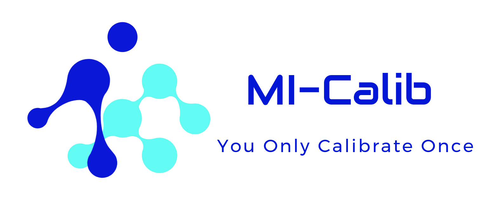

# MI-Calib: Multiple IMUs Spatiotemporal Calibrator

           

<div align=center></div>

### 3.2 Real-world Experiments

#### 3.2.1 Real-world Spatiotemporal Calibration for two IMUs

The data of the real-world experiments we conducted are available here:

```latex
# Google Drive
https://drive.google.com/drive/folders/11GTlHyzjSkt6ZXAZs9t6Tmg11Nah2Bx_?usp=sharing
```

There no difference between simulated launch and real-world one, but the information in config file. For better calibration results, you are expected to pre-calibrate the intrinsics of your IIMUs. Follow the following procedure to obtain them.

<div align=center></div>

#### 3.2.2 Stationary Intrinsics Calibration of IMUs

Considering that the weak observability of the intrinsic parameters (i.e., non-orthogonal factors, rotational misalign-
ments, and biases) in the proposed spatiotemporal calibration, they are required pre-calibrated, which can be accomplished in a separate process by introducing additional stationary prior.

The test datasets for intrinsic calibration are also available at the above Google Drive link. The datasets contain multiple rosbags, each one of them is collected when the body is under stationary. Altogether six kinds of poses are considered for better calibration performance.

Download the datasets, and pass their pathes to the configure named as `config-imu-intri-calib.yaml` . The stationary time pieces are required to be provided in this configure file. Then launch the file named as `mi-calib-imu-intri-calib.launch`:

```
roslaunch mi_calib mi-calib-imu-intri-calib.launch
```

The calibration results would be output as a single file, which would be involved in the following spatiotemporal calibration.