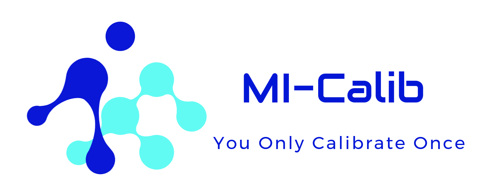
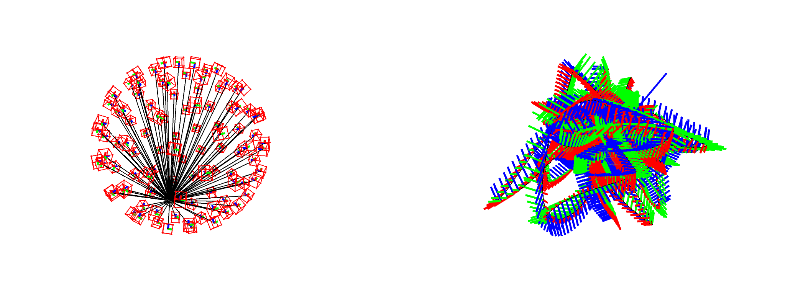

# MI-Calib: Multiple IMUs Spatiotemporal Calibrator

           

<div align=center></div>

### 3.1 Simulation Test

We have already deployed a a program for generating simulation data. Just go to `mi_calib/launch` folder . Then we launch:

```sh
roslaunch mi_calib mi-calib-simu.launch
```

this would generate a simulated rosbag and some related ground-truth files:

+ `simu_imus.bag`: the simulated rosbag:

  ```txt
  path:        simu_imus.bag
  version:     2.0
  duration:    7.9s
  start:       Jan 01 1970 08:00:01.00 (1.00)
  end:         Jan 01 1970 08:00:08.90 (8.90)
  size:        114.4 MB
  messages:    320000
  compression: none [148/148 chunks]
  types:       sensor_msgs/Imu [6a62c6daae103f4ff57a132d6f95cec2]
  topics:      /imu0/frame    3200 msgs    : sensor_msgs/Imu
               /imu1/frame    3200 msgs    : sensor_msgs/Imu
               /imu10/frame   3200 msgs    : sensor_msgs/Imu
               /imu11/frame   3200 msgs    : sensor_msgs/Imu
               /imu12/frame   3200 msgs    : sensor_msgs/Imu
               ...
  ```

+ `truth_align_to_imu0.yaml`: the ground-truth spatiotemporal parametrer yaml-format file:

  ```yaml
  CalibParam:
    EXTRI:
      SO3_BiToBr:
        - key: /imu0/frame
          value:
            qx: 0.0
            qy: 0.0
            qz: 0.0
            qw: 1
        - key: /imu1/frame
          value:
            qx: -0.8706789279833405
            qy: -0.1293033655598108
            qz: -0.3325697572013143
            qw: 0.338520605895337
         # ...
      POS_BiInBr:
        - key: /imu0/frame
          value:
            r0c0: 0
            r1c0: 0
            r2c0: 0
        - key: /imu1/frame
          value:
            r0c0: -0.9831585041044272
            r1c0: -1.350980588523048
            r2c0: 3.099204623917251
         # ...
    TEMPORAL:
      TIME_OFFSET_BiToBr:
        - key: /imu0/frame
          value: 0
        - key: /imu1/frame
          value: 0.001
        # ...
    INTRI:
      # ...
    GRAVITY:
      r0c0: 0
      r1c0: 0
      r2c0: -9.80
  ```

To perform calibration for the simulated data, you should change field '`config_path`' in '`mi_calib/launch/mi-calib-prog.launch`' to:

```sh
$(find mi_calib)/output/simu/config-simu.yaml
```

The file '`config-simu.yaml`' is a configure file for '`MI-Calib`', which could be found in folder '`mi_calib/output/simu`'. The detail configure information could determined be by yourself. Then, we launch '`MI-Calib`':

```sh
roslaunch mi_calib mi-calib-prog.launch
```

The calibration results would be output as a file named `param.yaml`.

<div align=center>
    
    </div>
